# Lab 3: Latches, Flip Flops, and Registers

Course: ENCE 3100 — Advanced Digital Design
Board: DE10-Lite

Notes: 
- After part 3 I rewrote DFF.v from get to behavior because the switch on the actual board was glitching. I was also told to do so in the lab manual.
- Part I: the Tech viewer screenshot below shows the latch collapsed into a single LUT, not the four separate LUTs (Figure 3b).
- Part II onward wires straight to the DE10-Lite's own SW/LEDR/KEY/HEX ports instead of hand-picking arbitrary pin names, since the board's pin assignments for those are already in main.qsf.
- Part V's A and B are 8-bit (2 hex digits each) instead of 16-bit (4 digits each), since the DE10-Lite only has 10 switches and 6 displays, not 16 switches and 8 displays. A and B share the same switch bank sequentially, so they have to be the same width, and 8 is the largest multiple of 4 that fits in 10 switches. HEX5/HEX4 are left blank.

---

## Part I — Gated RS Latch

Built the cross-coupled NOR latch from Figure 1 using the logic-expression style (Figure 2b): R_g = R & Clk, S_g = S & Clk, Qa = ~(R_g | Qb), Qb = ~(S_g | Qa), Q = Qa.

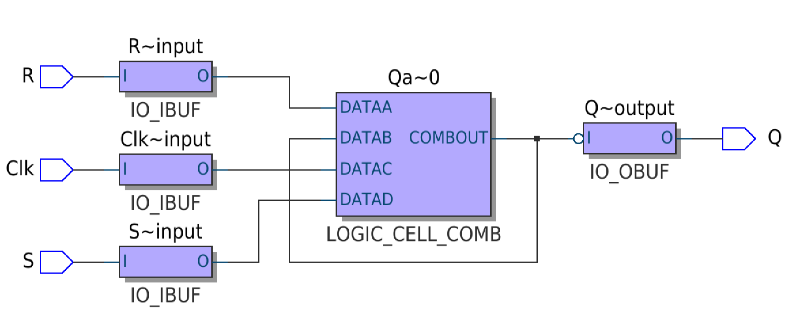

Tech Viewer: Quartus folded the whole latch into one LOGIC_CELL_COMB node with a self-feedback loop into DATAD. This is the single-LUT case (Figure 3a).

---

## Part II — Gated D Latch

Figure 4's D latch, built from NAND gates using the same logic-expression style: R = ~D, S_g = ~(D & Clk), R_g = ~(R & Clk), Qa = ~(S_g & Qb), Qb = ~(R_g & Qa), Q = Qa. This time R, S_g, R_g, Qa, Qb all carry synthesis keep so each stays a separate element instead of collapsing like Part I did.

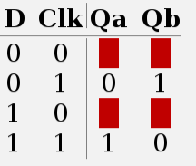

Truth table for the latch: transparent (Qa = D) whenever Clk = 1; holds its last value when Clk = 0, hence the don't care rows.

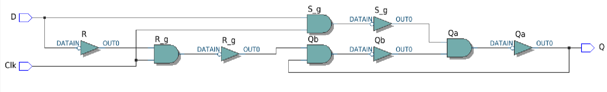

Netlist viewer with keep in place: R, R_g, S_g, Qa, Qb each show up as their own element instead of merging into one LUT, confirming the directive worked.

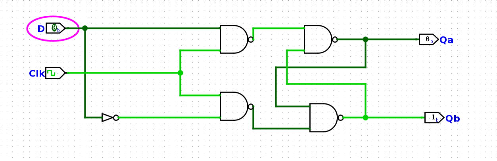

Logisim model of the same NAND latch for reference, matching Figure 4.

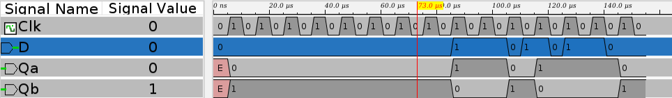

Simulation: Qa tracks D continuously while Clk = 1 and freezes the instant Clk drops to 0, confirming transparent-latch behavior.

---

## Part III — Master-Slave D Flip-Flop

I Built the edge-triggered flip flop from Figure 5 by instantiating the Part II gated D latch twice: a Master latch clocked on ~Clk, then feeding a Slave latch connected to a non-inverted Clk. Master is transparent while Clk is low, Slave is transparent while Clk is high, so data only makes it all the way through on the rising edge.

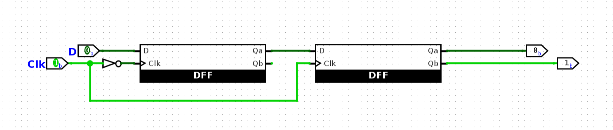

Logisim: D/Clk into Master with an inverted clock, Master.Q into Slave, Slave.Q out as Q.

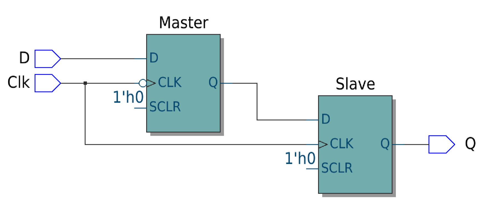

Netlist: Master and Slave each map to the correct latch hardware, with the bubble on Master's CLK confirming the inverted clock. SCLR is tied to 1'h0 since this design has no reset. This matches my logisim simulation too.

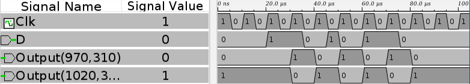

Simulation: unlike Part II's latch, the output here only changes in response to a clock edge, not every time D changes.

### Board verification

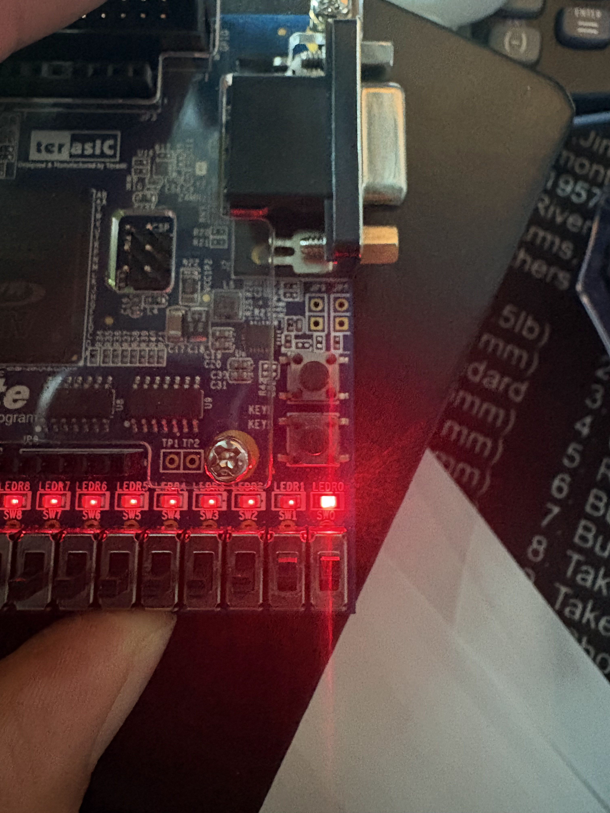
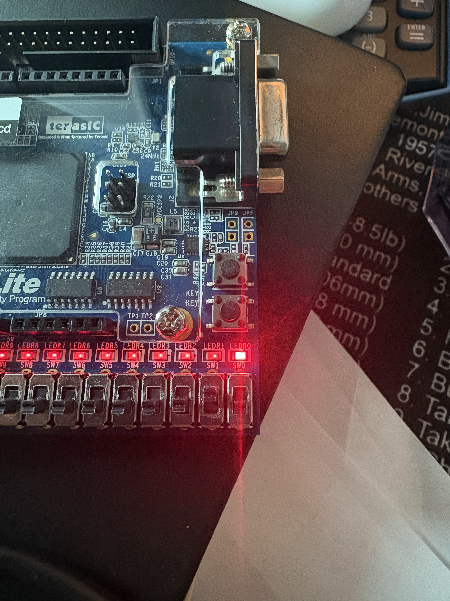
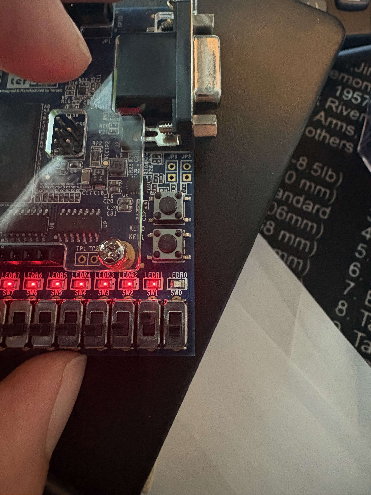

D on SW0, Clk on SW1, Q on LEDR0. Flipping D while toggling Clk confirms Q only updates on the Clk low to high transition.

---

## Part IV — Latch vs. Posedge FF vs. Negedge FF

Figure 6 asks for three storage elements sharing the same D/Clk side by side: a gated latch, a positive-edge-triggered FF, and a negative-edge-triggered FF. Built as Part4_Top.v:

- Qa — Part II's DFF latch directly, Clk uninverted.
- Qb — Part III's MasterSlaveDFF, Clk uninverted (posedge).
- Qc — the same MasterSlaveDFF, fed ~Clk instead (negedge).

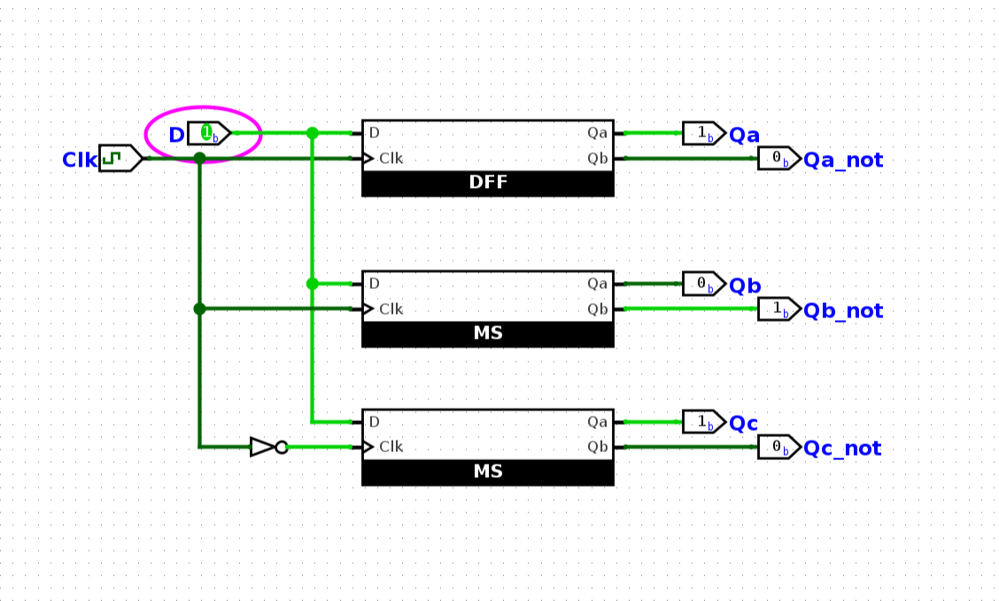

Top-level model: one D/Clk fans out to the latch and both master-slave instances, matching Figure 6a's layout (no inverter drawn except the one feeding Qc's instance).

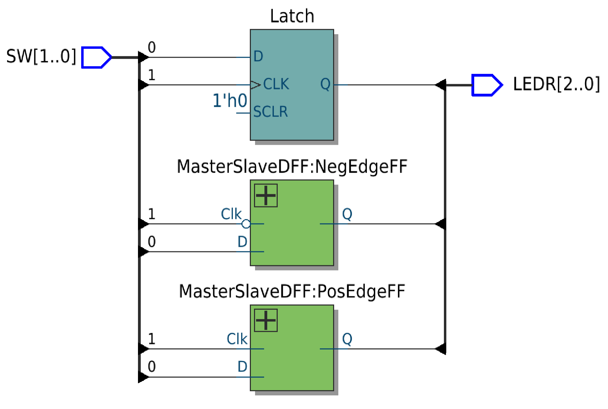

Netlist: Latch maps to the same hardware latch primitive as Part III. The two MasterSlaveDFF instances show as collapsed hierarchy blocks (expandable into the same Master/Slave latch pair from Part III) rather than the chip's native edge-triggered flip-flop primitive — worth noting since the handout's step 3 asks you to confirm the FFs use the target FPGA's dedicated flip-flops specifically. Functionally correct, but if that distinction matters for grading, Qb/Qc would need to be rewritten with always @(posedge Clk) / always @(negedge Clk) behavioral code instead of the structural master-slave build.

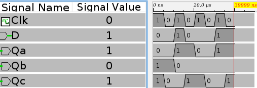

Simulation of Clk, D, Qa, Qb, Qc together. Note: Qa (the latch) doesn't visibly track every D wiggle in this trace — that's a simulator display quirk (the waveform grid only redraws at clock ticks), not a functional bug; Qa was confirmed to track D continuously on the real board (see Part II's board behavior check).

### Board verification

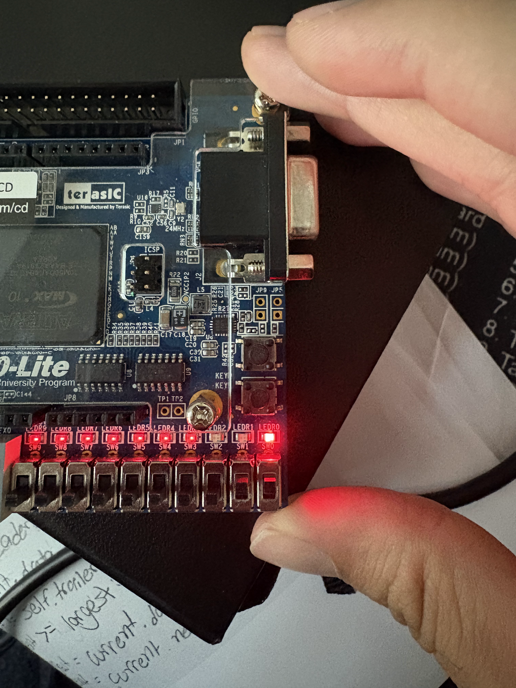
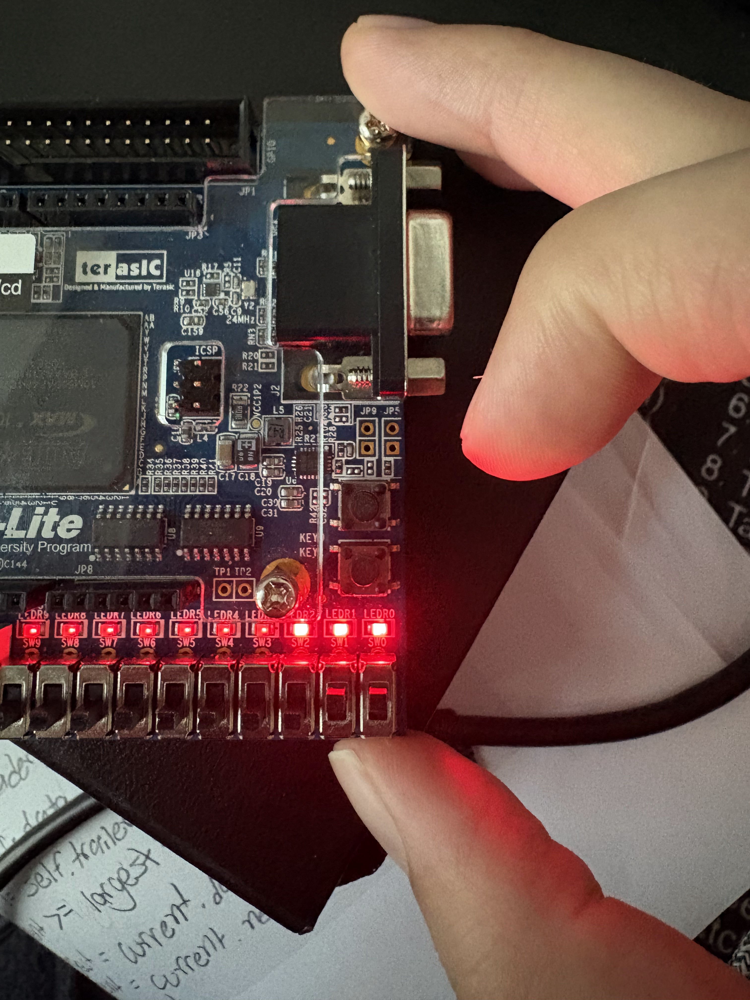
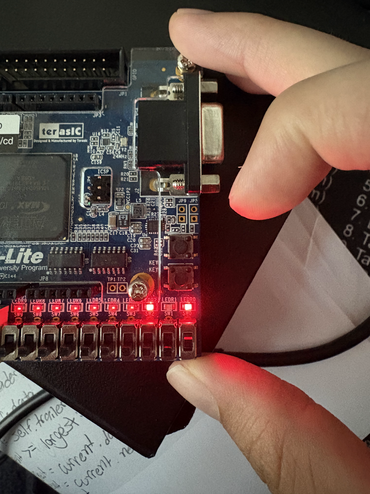

D on SW0, Clk on SW1, Qa/Qb/Qc on LEDR0/LEDR1/LEDR2. Different switch combinations confirm the three LEDs don't always match each other. The latch updates live, while the two FFs only update on their respective clock edge.

---

## Part V — Stored Hex Display

Because of the board difference, I scaled the down the register to be 8 bits. SW[7:0] enters both A and B, one at a time. The SW[7:0] loads on every KEY1 press, and B has no storage at all, it is just SW[7:0] wired straight through.

A decodes onto HEX3/HEX2, B onto HEX1/HEX0, HEX5/HEX4 tied to blank (8'hFF) since they're unused. I Reused the Seg7_Decoder module from Lab 2 rather than rewriting it, since it's the same board.

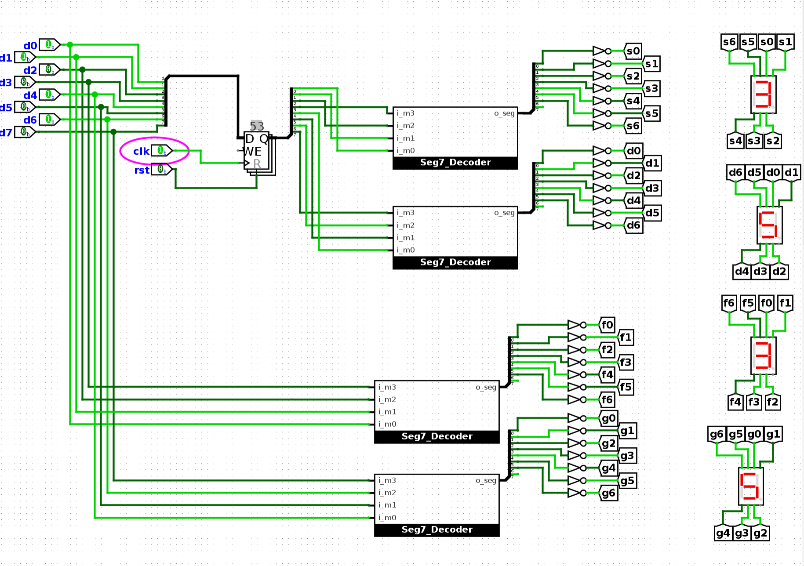

Logisim model: one 8-bit register (D, clk, rst) split via a splitter into two nibbles feeding two Seg7_Decoders for A; B split the same way straight from the switch inputs into two more decoders, no register in that path.

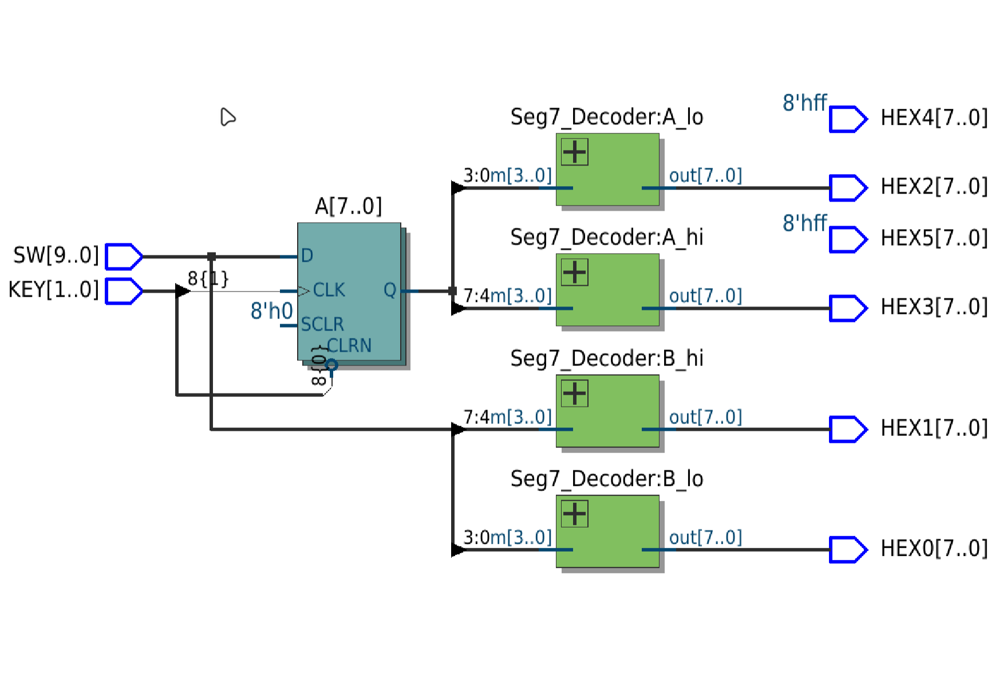

Technology Viewer: A[7..0] register loads from SW[9..0] (effectively just the low 8 bits) on KEY1/KEY0, split into A_hi/A_lo. B_hi/B_lo trace back to the same switches directly, bypassing the register entirely.

### Board verification

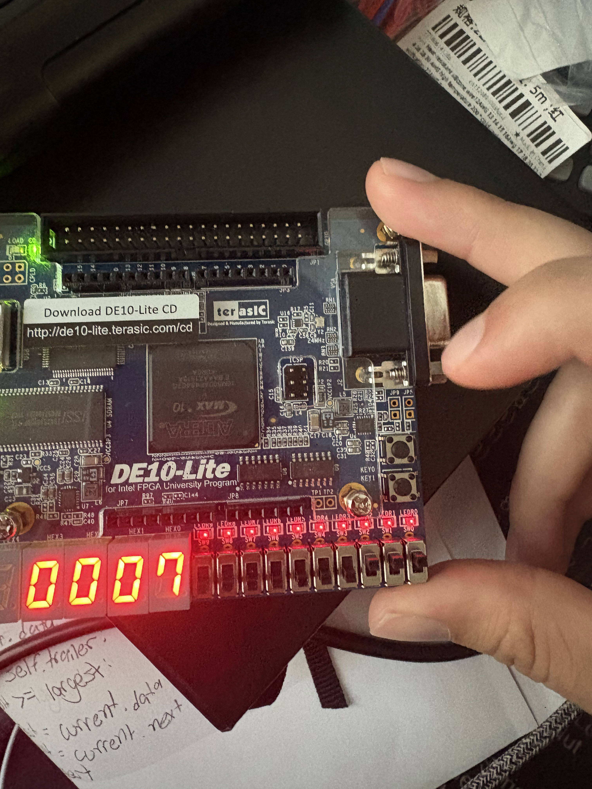
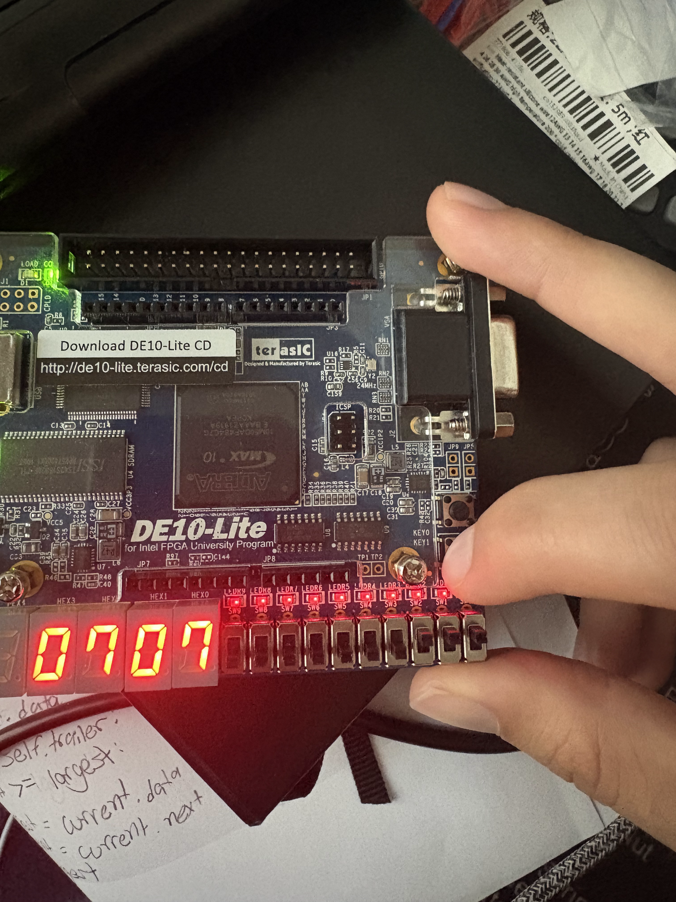

SW[7:0] = 7, before pressing KEY1: B (HEX1/HEX0) shows 07 live off the switches, while A (HEX3/HEX2) is still 00 from the last reset/clear — confirming B doesn't need a clock to update.

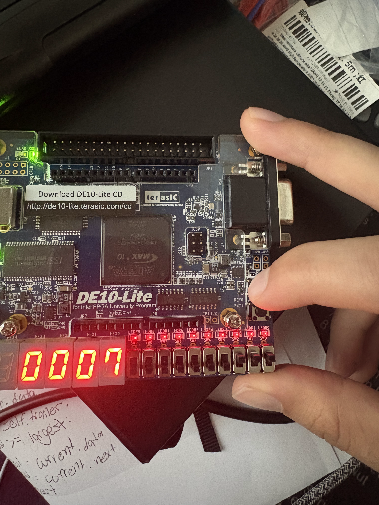

Same switch setting, after pressing KEY1: A now reads 07 too, matching B, confirming the register latched the switch value on the KEY1 press.

---

## Summary

| Part | Module(s) | Reuses |
|---|---|---|
| I | main.v (gated RS latch, NOR-based, no keep) | — |
| II | DFF.v (gated D latch, NAND-based, with keep) | — |
| III | MasterSlaveDFF.v | DFF.v x2 |
| IV | Part4_Top.v (Latch, PosEdgeFF, NegEdgeFF) | DFF.v, MasterSlaveDFF.v x2 |
| V | main.v (8-bit register + live passthrough) | Seg7_Decoder.v (from lab2) |

